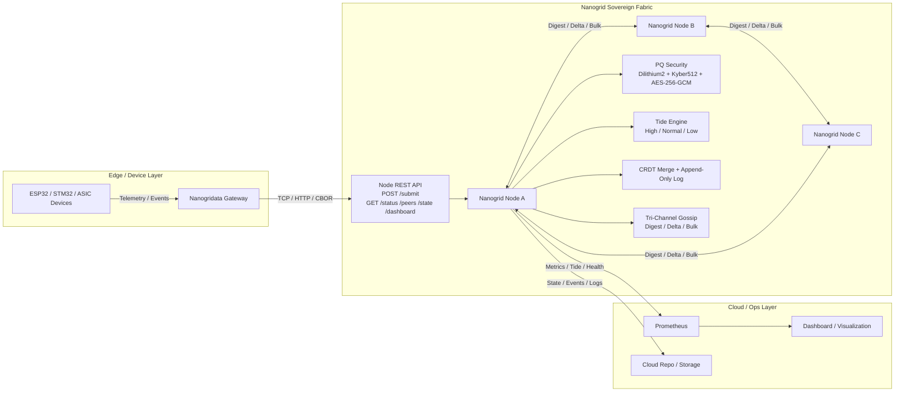

# Ultra Hardware Node Spec (Hᴜ) — RISC-V Based

## 1. Overview

The Ultra Hardware Node (Hᴜ) is a low-power, secure, and efficient device designed for edge and distributed computing in the Sovereign Nanogrid Fabric. It prioritizes sovereignty, post-quantum security, and offline resilience.

Nanogrid është një fabric i shpërndarë, sovereign, post-quantum secure dhe adaptive, i ndërtuar me Rust për performancë dhe siguri maksimale.

## 2. CPU

- Architecture: RISC-V 64-bit
- Cores: 8–32 cores (configurable for workload)
- Extensions: Vector (RV64V) for compute-intensive ops, Bit manipulation (RV64B)
- Clock Speed: 1–2 GHz (energy-efficient)
- Purpose: Handles algebraic ops, gossip, and CBOR processing deterministically.

## 3. Memory

- Type: ECC-protected DDR4/DDR5
- Capacity: 32–128 GB
- Access: Low-latency, zero-copy for CBOR buffers
- Purpose: Stores in-memory state for fast loop operations.

## 4. Storage

- Type: NVMe SSD (append-only)
- Capacity: 1–4 TB
- Interface: PCIe Gen 4/5
- Features: Hardware encryption (AES-256), wear-leveling
- Purpose: Append-only logs for storage ops, replay-safe.

## 5. Network

- Interfaces: Dual 10/25/100 GbE NICs
- Protocols: RDMA-like zero-copy (RoCE or iWARP), fallback to TCP
- Security: Hardware offload for PQ crypto
- Purpose: Gossip channels (digest, delta, bulk) with minimal latency.

## 6. Security Elements

- Secure Enclave: RISC-V with PMP (Physical Memory Protection)
- Root of Trust: Hardware-bound PQ key storage (Dilithium root key)
- TPM-like: For key rotation and attestation
- Purpose: Protects node identity and prevents tampering.

## 7. Power & Resilience

- Consumption: <50W (low-power mode)
- Battery Backup: 10–30 minutes for brownout protection
- Resume: Instant state recovery from append-only log
- Purpose: Offline-tolerant, survives power disruptions.

## 8. Form Factor

- Size: Rack-mountable (1U) or edge (mini-PC)
- OS: Minimal Linux (Alpine or custom RISC-V distro)
- Boot: Secure boot with PQ verification
- Purpose: Deployable in data centers, edge locations, or remote sites.

## 9. Performance Targets

- Throughput: 10,000+ ops/sec for algebraic computations
- Latency: <1ms for local ops, <100ms for gossip
- Uptime: 99.9% with self-healing
- Scalability: Nodes form mesh without central control.

This spec ensures the hardware is future-proof, quantum-safe, and aligned with the fabric's algebraic nature.

## 10. Nanogridata ↔ Nanogrid ↔ Cloud Integration Diagram

### Integration Notes

- `Nanogridata Gateway` ingests telemetry/events from edge devices and injects ops into `Nanogrid Node` via `POST /submit`.
- `Nanogrid` applies Post-Quantum Security (`Dilithium2`, `Kyber512`, `AES-256-GCM`), deterministic `CRDT Merge`, and adaptive replication via `Tide Engine` (`High/Normal/Low`).
- `Tri-Channel Gossip` enables efficient sync across peers: digest (summary), delta (incremental), bulk (full recovery).
- `Prometheus + Dashboard` provide observability for node status, tide behavior, and fabric health.
