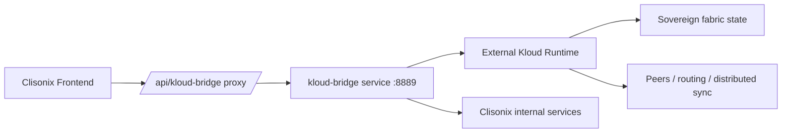

# Kloud + Clisonix — Integration Status

**Date:** 2026-04-02  
**Scope:** Current architecture, completed work, production posture, and known next steps.

## Related Documents

- `KLOUD_CLISONIX_README.md`
- `docs/architecture/KLOUD_CLISONIX_BILINGUAL_ONE_PAGER.md`
- `docs/architecture/KLOUD_CLISONIX_FUTURE_PLAN.md`

---

## Executive Summary

`Kloud` and `Clisonix` are now positioned as **integrated but isolated** systems:

- `Kloud` remains the sovereign distributed runtime in its own repository.
- `Clisonix` consumes that capability through an isolated service named `kloud-bridge`.
- The public-facing UI has been hardened toward **live-only** behavior, with no fake/demo values shown to customers.

This approach protects the core `Kloud` IP while allowing `Clisonix` to expose clean operational value through a production-ready contract layer.

---

## Strategic Decision Already Made

### ✅ “Bashkë në arkitekturë, jo bashkë në kod”

The adopted direction is:

1. **Do not merge** the `Kameleonlife/Kloud` codebase into `Clisonix`.
2. **Do expose** `Kloud` through APIs, bridge services, and controlled contracts.
3. **Do keep** the sovereign runtime, security model, and distributed fabric isolated.

This is the correct long-term model for:

- security isolation
- IP protection
- modular deployment
- enterprise integration
- future licensing and packaging

---

## What Has Been Built So Far

### 1) NanoGrid reusable package

A shared integration package was prepared under:

- `packages/nanogrid`

Purpose:

- packet creation/parsing
- secure payload handling
- interop layer across repos

This gives `Clisonix` a portable way to speak a consistent NanoGrid/Nanogrid protocol.

### 2) Cross-repo sync workflow

A profile sync script was created:

- `scripts/sync-nanogrid-profile.ps1`

Purpose:

- copy/update shared NanoGrid assets into other repos
- keep common protocol logic reusable
- intentionally **skip `Kloud`** as an isolated sovereign repo

### 3) Isolated microservice inside Clisonix

A new service was created:

- `services/kloud_bridge/`

Key endpoints:

- `GET /health`
- `GET /status`
- `POST /signals/publish`
- `POST /fabric/sync`

Purpose:

- connect Clisonix workloads to the external `Kloud` runtime
- act as the clean contract boundary
- avoid direct codebase coupling

### 4) Frontend module / customer-facing view

A new module page was created:

- `apps/web/app/modules/kloud-bridge/page.tsx`

Purpose:

- show bridge health
- show upstream connectivity state
- expose sync actions in a professional UI

### 5) Production hardening

Recent fixes included:

- removal of fake/demo values from the `Kloud Bridge` experience
- live-only policy for status/sync actions
- Auth session fix to prevent `MissingSecret` errors
- Windows-safe rate-limit logging to avoid unicode console crashes

---

## Current Architecture

---

## Current Production Posture

| Area | Status | Notes |
|---|---|---|
| Repo isolation model | ✅ Done | `Kloud` stays separate from `Clisonix` |
| NanoGrid shared package | ✅ Done | Reusable interop foundation exists |
| `kloud-bridge` microservice | ✅ Done | Running design established |
| Frontend module | ✅ Done | Public module/tab exists |
| Fake/demo fallback removal | ✅ Done | Live-only approach enforced |
| Upstream Kloud connection | ⏳ Pending config | Needs `KLOUD_UPSTREAM_URL` in target environment |
| Customer-safe presentation | ⏳ In progress | More UI simplification can continue |

---

## Important Operational Note

When the bridge service is **running**, `/api/kloud-bridge/*` can return `200`.
When the local or deployed upstream is **not running/reachable**, the frontend proxy can return `502`.

This is expected behavior and is better than showing fake data.

### In practice

- `200` = service reachable
- `503` = live-only mode active but upstream not configured
- `502` = proxy cannot reach the underlying service/runtime

---

## Customer-Facing Data Policy

The direction now is explicit:

- no demo values in production
- no synthetic status pretending to be live
- no random placeholder telemetry for clients
- show only:
  - real state
  - degraded state
  - disconnected state
  - live synchronized state

This aligns with the platform’s production posture and trust requirements.

---

## Known Gaps

The main remaining gaps are operational, not conceptual:

1. `KLOUD_UPSTREAM_URL` must be configured wherever live data is expected.
2. The bridge should be supervised with health checks and restart policies.
3. The customer UI can be simplified further so only business-relevant data is visible.
4. Authentication/authorization should later be applied for tenant-safe access to bridge actions.

---

## Recommended Immediate Next Step

### Priority 1

Wire `kloud-bridge` to a real reachable `Kloud` endpoint and verify:

- `GET /health`
- `GET /status`
- `POST /fabric/sync`

with real data in the target environment.

---

## Summary

The core foundation is now in place:

- architecture decided
- isolation preserved
- bridge service created
- frontend module created
- live-only policy established

The next stage is to move from **integration scaffolding** to **stable production connectivity**.
